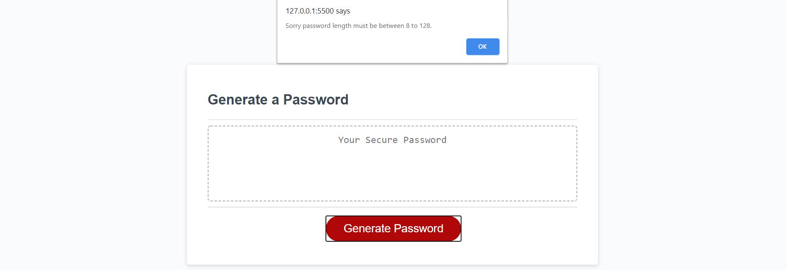
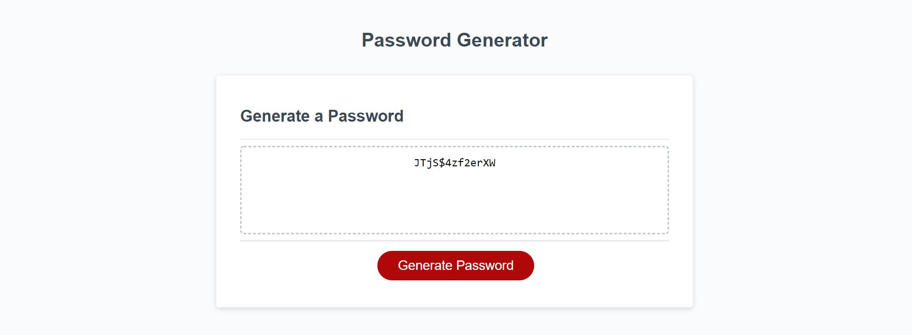
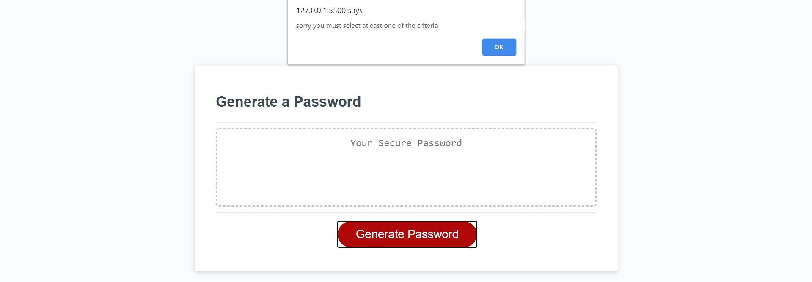

this shows the user not being able to move forward in the code genertor if they do not pick a character length between 8 adn 128

this showcases a user selecting a password with a character length of 13 and all 4 character criteria

if a use doesnt select any criteria they are met with this message

